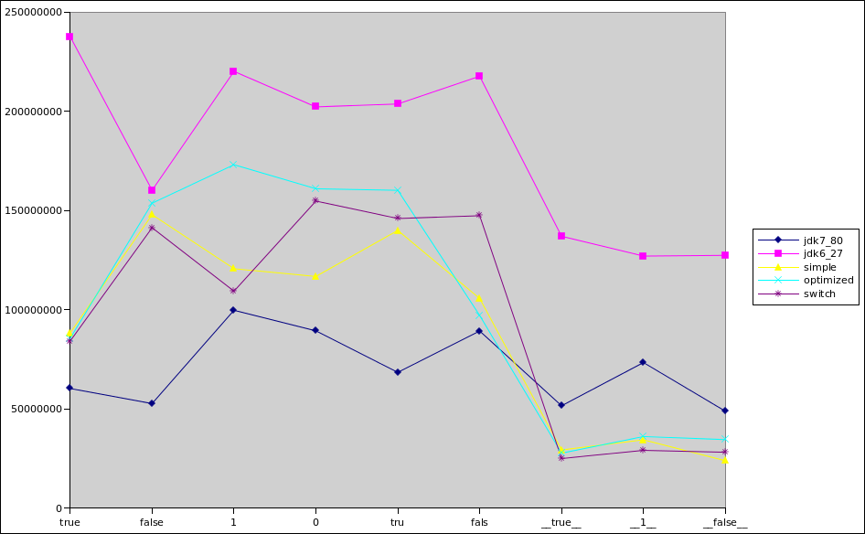

# crazy-soap

Soap Code Black Magic

see https://docs.google.com/presentation/d/1Y9NbTeAaftvAY00eJlU14RDbZTbqHmJJia_OX88etAM/edit?usp=sharing

## Perf Tests (with jmh)

```
Benchmark                                      Mode  Cnt          Score   Error  Units
ParseBooleanTestJDK7_80.parse_false           thrpt    2   73400511,600          ops/s
ParseBooleanTestJDK7_80.parse_falseTypo       thrpt    2   89640753,643          ops/s
ParseBooleanTestJDK7_80.parse_one             thrpt    2  183311579,961          ops/s
ParseBooleanTestJDK7_80.parse_true            thrpt    2   85892400,632          ops/s
ParseBooleanTestJDK7_80.parse_trueTypo        thrpt    2  110524920,689          ops/s
ParseBooleanTestJDK7_80.parse_zero            thrpt    2  172608549,628          ops/s
ParseBooleanTestOptimized.parse_false         thrpt    2  282254361,860          ops/s
ParseBooleanTestOptimized.parse_falseTypo     thrpt    2  222494844,073          ops/s
ParseBooleanTestOptimized.parse_one           thrpt    2  254279599,107          ops/s
ParseBooleanTestOptimized.parse_true          thrpt    2  165777751,814          ops/s
ParseBooleanTestOptimized.parse_trueTypo      thrpt    2  274268472,574          ops/s
ParseBooleanTestOptimized.parse_zero          thrpt    2  255016387,082          ops/s
ParseBooleanTestSimple.parse_false            thrpt    2  170186950,335          ops/s
ParseBooleanTestSimple.parse_falseTypo        thrpt    2  112574207,285          ops/s
ParseBooleanTestSimple.parse_one              thrpt    2  116749421,314          ops/s
ParseBooleanTestSimple.parse_true             thrpt    2  100308410,122          ops/s
ParseBooleanTestSimple.parse_trueTypo         thrpt    2  172434443,027          ops/s
ParseBooleanTestSimple.parse_zero             thrpt    2  131446046,458          ops/s
ParseBooleanTestStringSwitch.parse_false      thrpt    2  174452560,822          ops/s
ParseBooleanTestStringSwitch.parse_falseTypo  thrpt    2  176402174,693          ops/s
ParseBooleanTestStringSwitch.parse_one        thrpt    2  127802180,878          ops/s
ParseBooleanTestStringSwitch.parse_true       thrpt    2  107213284,625          ops/s
ParseBooleanTestStringSwitch.parse_trueTypo   thrpt    2  177214574,622          ops/s
ParseBooleanTestStringSwitch.parse_zero       thrpt    2  188824034,479          ops/s
```


